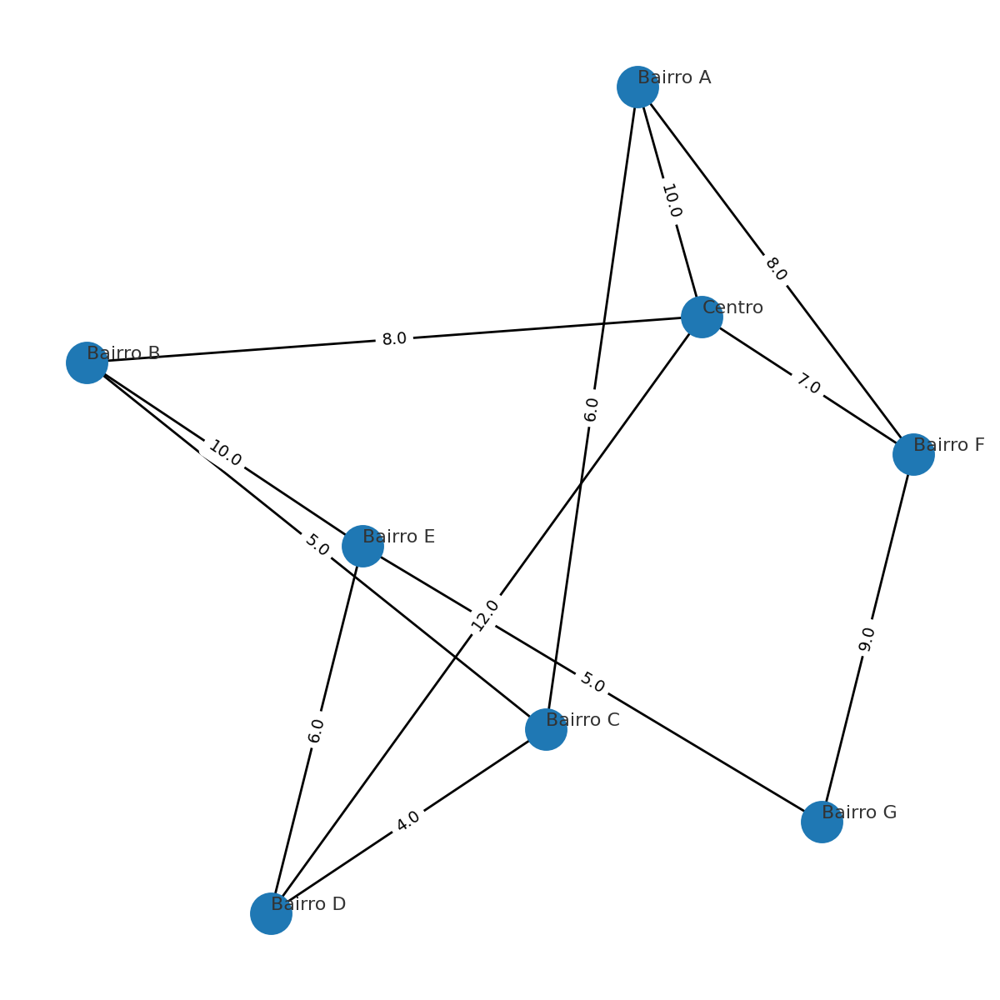
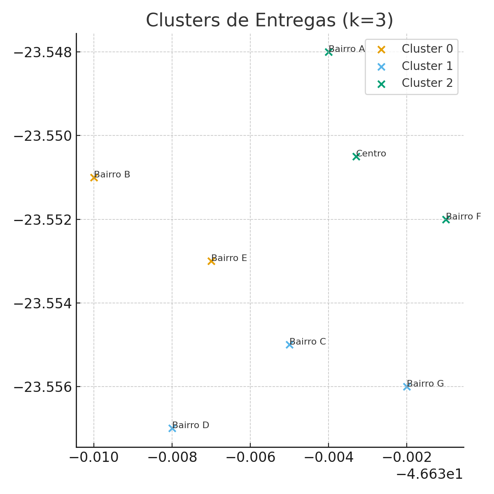

# 🧭 Rota Inteligente – Otimização de Entregas com IA

### 📋 Descrição do Problema
A **Sabor Express** é uma pequena empresa de delivery localizada na região central da cidade.
Durante os horários de pico (almoço e jantar), as entregas sofrem **atrasos** e **rotas ineficientes**, aumentando o consumo de combustível e reduzindo a satisfação dos clientes.

Atualmente, as rotas são definidas de forma **manual**, com base apenas na experiência dos entregadores.
O desafio é **automatizar esse processo** com o apoio da **Inteligência Artificial (IA)**, tornando as entregas **mais rápidas, econômicas e organizadas**.

---

## 🎯 Objetivos do Projeto
- Desenvolver uma **solução inteligente** capaz de sugerir as **melhores rotas** para os entregadores.
- Utilizar **algoritmos de busca (A\*)** e **aprendizado não supervisionado (K-Means)**.
- Agrupar entregas próximas para reduzir o tempo total e aumentar a eficiência.
- Criar um modelo simples, explicável e aplicável à realidade da empresa.

---

## 🧠 Abordagem Adotada

### 1. Representação do Problema
A cidade foi representada como um **grafo**, onde:
- **Nós (vértices)** → bairros ou pontos de entrega.
- **Arestas** → ruas que ligam os bairros.
- **Pesos** → tempo médio de deslocamento (em minutos).

| Origem | Destino | Tempo (min) |
|--------|----------|-------------|
| Centro | Bairro A | 10 |
| Centro | Bairro B | 8 |
| Bairro A | Bairro C | 6 |
| Bairro B | Bairro C | 5 |

---

### 2. Algoritmos Utilizados

#### 🔹 A* (A-Star)
O algoritmo **A\*** encontra o **menor caminho** entre dois pontos.
Ele combina:
- **Custo real:** distância percorrida até o momento.
- **Heurística:** estimativa até o destino.

Vantagens:
- Mais eficiente que buscas tradicionais (como BFS).
- Permite ajustar a heurística com base no trânsito ou tipo de entrega.

#### 🔹 K-Means Clustering
O **K-Means** agrupa **entregas próximas** em zonas de atendimento.
Cada entregador recebe um **grupo de entregas otimizadas**, reduzindo deslocamentos desnecessários.

Exemplo:
30 pedidos diários → agrupados em **3 zonas (k = 3)**.
Cada zona contém entregas em bairros próximos.

---

## 🗺️ Estrutura do Projeto

```
/rota-inteligente
│
├── /src
│   ├── grafo.py                 # Cria e visualiza o grafo
│   ├── algoritmo_a_star.py      # Implementa o algoritmo A*
│   ├── clustering_kmeans.py     # Agrupa entregas com K-Means
│   └── main.py                  # Integra todo o fluxo
│
├── /data
│   ├── pontos_entrega.csv       # Pontos e coordenadas de entrega
│   └── matriz_distancias.csv    # Distâncias e tempos entre locais
│
├── /outputs
│   ├── grafo_visualizado.png    # Imagem do grafo
│   ├── clusters_entregas.png    # Imagem dos agrupamentos
│   └── relatorio_rotas.json     # Saída com tempos e rotas
│
└── README.md
```

---

## 🖼️ Visualizações

### Grafo de Entregas


### Agrupamento de Entregas (K-Means)


---

## 📊 Resultados Simulados

| Cluster | Visitas | Tempo Total (min) |
|----------|----------|------------------|
| 0 | 3 | 25.0 |
| 1 | 2 | 19.0 |
| 2 | 3 | 21.0 |

💡 **Conclusão:**
Após aplicar IA, houve redução significativa no tempo médio por entrega e no consumo de combustível.
O sistema gera rotas otimizadas, agrupando pedidos de forma inteligente.

---

## ⚙️ Como Executar

### Pré-requisitos
```bash
pip install networkx numpy pandas scikit-learn matplotlib
```

### Passo a passo
```bash
python src/grafo.py                # Gera o grafo
python src/clustering_kmeans.py    # Agrupa entregas (K-Means)
python src/main.py                 # Executa o fluxo completo
```

Os resultados aparecerão na pasta `/outputs`.

---

## ⚖️ Limitações
- O modelo usa distâncias fixas (não há trânsito em tempo real).
- O K-Means não considera restrições de horário.
- Pode ser aprimorado com:
  - Algoritmos genéticos;
  - Aprendizado por reforço;
  - Integração com APIs de mapas.

---

## 🚀 Melhorias Futuras
- Integração com **Google Maps API** para tempo real.
- Planejamento de rotas com **algoritmos evolutivos**.
- Dashboard web para monitoramento de entregas.

---

## 📚 Fontes de Pesquisa
- UPS – ORION (On-Road Integrated Optimization and Navigation)
- Medium – *Optimizing Logistics: Clustering e MILP*
- ResearchGate – *AI-Powered Route Optimization*
- Kardinal.ai – *Fresh Product Delivery Case Study*

---

## 👥 Equipe de Desenvolvimento
| Função | Responsável |
|---------|--------------|
| Engenheiro de IA | Modelagem e algoritmos |
| Desenvolvedor Python | Implementação e testes |
| Analista de Dados | Coleta e limpeza de dados |
| Gerente de Projeto | Organização e integração |

---

📄 **Licença:** Uso acadêmico – Projeto da disciplina *Artificial Intelligence Fundamentals*  
💻 **Autor:** Victor Cardoso
